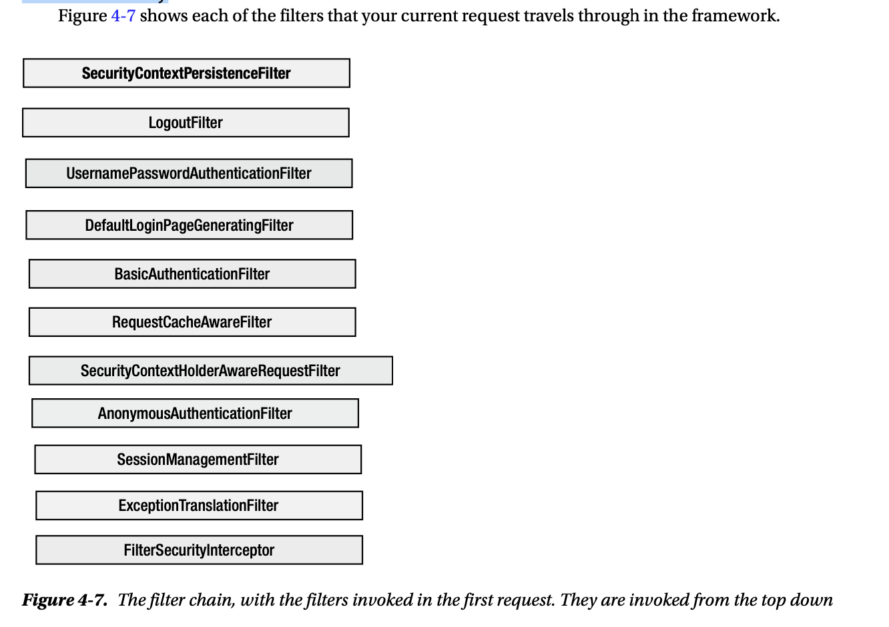
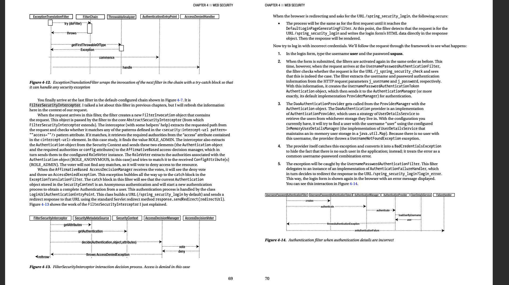
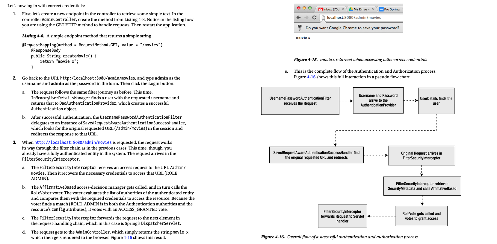

# Chapter 4

### Filter chain

#### SecurityContextPersistenceFilter

When the request hits this filter, the framework tries to retrieve 
a SecurityContext from the standard Servlet session (javax.servlet.http.HttpSession).
   
If there is not a context in the session, or the session itself is null (that is,
it still doesn’t exist because it hasn’t been created yet), 
the framework creates a new empty SecurityContext
(or, more accurately, an instance of its implementation class SecurityContextImpl). 
This is what happens in your current request. A new SecurityContext is created and associated 
to the current thread of execution. The request is then sent to the next filter in the chain.

#### LogoutFilter

Because the request is not for the URL /j_spring_security_ logout, 
the filter simply forwards the request to the next filter in the chain.

#### UsernamePasswordAuthenticationFilter

Because this request is not for the URL /j_spring_security_check, 
the filter simply forwards the request to the next filter in the chain. 

#### DefaultLoginPageGeneratingFilter

This filter will see that the request is not for the URL 
/spring_security_login and will forward the request to the next filter in the chain. 

#### BasicAuthenticationFilter

This filter looks for HTTP Basic Authentication headers in the request (the header “Authorization” with a value starting with “Basic”). Because none are found,
the filter forwards the request to the next filter in the chain. As in the previous three filters, this interaction is simple and can be explained with the same simple diagram. The only difference is that instead of looking at the path
of the request, this filter looks at the headers (request.getHeader("Authorization")).

#### RequestCacheAwareFilter

The request arrives at the RequestCacheAwareFilter filter, 
which won’t find any cached requests matching the current request. 
So it forwards the original request to the next filter. 
Cached requests are used normally when you do temporal redirections 
(like when you redirect to the login page) and then want to redirect back to the previously
 requested URL. 
 
#### SecurityContextHolderAwareRequestFilter

This filter wraps the request in a SecurityContextHolderAwareRequestWrapper, which 
implements the Servlet API security methods and forwards this request to the next filter 
in the chain.

#### AnonymousAuthenticationFilter

When your request hits this filter,
the framework will see that there is no Authentication object currently set in the SecurityContext, and it creates an
AnonymousAuthenticationToken. This object plays the role of an anonymous user in the system.
As a matter of fact, it will have a username of anonymousUser and will be the granted 
authority ROLE_ANONYMOUS in the system.

#### SessionManagementFilter

At this moment, there is still no active Servlet session in the system for the particular agent that is accessing it. This filter checks that the current request is with an anonymous Authentication object (which was set by the previous filter in the context) and, finding that it is, it simply forwards the request to the next filter in the chain.

#### ExceptionTranslationFilter

When the request arrives here, the only processing is to wrap the invocation to the next filter in the chain in a try..catch block. If any subsequent filter, or the request handler itself, throws an exception it will be caught by the catch block in this filter. This actually happens for the current request, as you will see when I describe the next filter.

#### FilterSecurityInterceptor

### Decision manager

#### AffirmativeBased

This access decision manager calls all its configured voters, and if any of them votes
that access should be granted, it is enough for the access decision manager to allow 
access to the secured resource. 

#### ConsensusBased

This access decision manager implementation calls all its configured voters to make a
decision to either grant or deny access to a resource. The difference with the
AffirmativeBased decision manager is that the ConsensusBased decision manager decides 
to grant access only if there are more voters granting access than voters denying it. 

#### UnanimousBased

As you probably guessed, this access decision manager will grant access to the resource 
only if all the configured voters vote in favor of allowing access to the resource.

### AccessDecisionVoter

#### Role voter

### The Special URLs

• /j_spring_security_check   
This URL is used by the framework to determine that the incoming request is 
sending authentication information and asking to check these credentials and 
authenticate correspondingly.

• /j_spring_security_logout 
This URL is used by the framework to log out the currently
logged-in user, invalidating the corresponding session and SecurityContext.
• 
/spring_security_login This is the URL that Spring Security uses to show the 
login form for the application. The framework will redirect to this URL when an 
authentication is needed but doesn’t exist yet.

### Authentications

#### Custom Login Form

Stores username password in request body

#### Basic HTTP Authentication

Stores basic token in Authentication header

#### Digest Authentication

Digest Authentication is a very close sibling of Basic HTTP Authentication. Its main purpose is to avoid sending clear text passwords on the wire, as Basic Authentication does, by hashing the password prior to sending it to the server. This makes Digest Authentication more complex than Basic Authentication.
Digest Authentication works with HTTP headers the same way that Basic Authentication does.
Digest Authentication is based in the use of a nonce for hashing the passwords. A nonce is an arbitrary server-generated number that is used in the authentication process and that is used only once. 

#### RememberMe Authentication

Creates a cookie and validates against it.

### Logging Out

/j_spring_security_logout